# 🚀 Guida Completa al Deploy di Fededrome

Questa guida descrive passo-passo tutta la procedura di deployment in produzione dell'intera infrastruttura Fededrome (Frontend Flutter/Web, FastAPI Backend, Redis e Supabase Self-Hosted) su un singolo droplet VPS (es. DigitalOcean) con configurazione DNS coerente e certificati SSL automatici.

---

## 🗺️ Architettura di Rete e Schema DNS

Tutti i servizi sono esposti in modo sicuro sotto HTTPS usando un unico indirizzo IP pubblico del Droplet VPS. Nginx funge da gateway principale, gestendo la terminazione SSL e smistando le richieste in base al nome di dominio.

```mermaid
graph TD
    Client[Client Mobile / Web] -->|https://fededrome.app| Frontend[Hosting Web es. Vercel / Netlify]
    Client -->|https://api.fededrome.app| Nginx[VPS Nginx Reverse Proxy - Porta 443]
    Client -->|https://db.fededrome.app| Nginx
    
    subgraph VPS ["Droplet VPS (Docker)"]
        Nginx -->|Rete Interna Docker:8000| FastAPI[FastAPI Backend - fededrome_api]
        Nginx -->|Rete Interna Docker:8000| Kong[Supabase Kong Gateway - supabase-kong]
        FastAPI -->|Rete Interna Docker:8000| Kong
        FastAPI -->|Porta 6379 Interna| Redis[Redis Cache - fededrome_redis]
        Kong -->|Porta 5432| DB[(Supabase Postgres - supabase_db)]
        Kong -->|Porta 9999| Auth[Supabase Auth / GoTrue - supabase_auth]
    end
    
    Auth -->|SMTP Porta 587| SMTP[Provider SMTP es. Resend / Brevo]
```



### Tabella dei Domini e Puntamenti Coerenti

| Servizio / Risorsa | Indirizzo URL Configurato | Puntamento DNS / Target | Note |
| :--- | :--- | :--- | :--- |
| **Sito Web / Frontend** | `https://fededrome.app` | Record A → IP Host (Vercel / VPS) | Origine CORS autorizzata |
| **API Backend (FastAPI)** | `https://api.fededrome.app` | Record A → IP Droplet VPS | Gestito da Nginx su VPS |
| **Database & Auth (Supabase)** | `https://db.fededrome.app` | Record A → IP Droplet VPS | Gestito da Nginx → Kong |
| **Google Redirect URI** | `https://db.fededrome.app/auth/v1/callback` | Configurato su Google Cloud Console | Callback del login social |
| **Deep Linking Flutter** | `fededrome://*` | Schema custom mobile autorizzato | Gestisce il rientro in-app |

---

## 📡 Fase 1: Configurazione del Dominio e DNS (su Name.com)

Avendo acquistato il dominio su **Name.com**, puoi configurare i puntamenti DNS in due modi diversi:

### Opzione A: Configurare i record direttamente su Name.com (Consigliato)
1. Accedi a [Name.com](https://www.name.com) ed entra nella tua Dashboard.
2. Clicca sul dominio `fededrome.app` e vai su **DNS Templates** o **DNS Records**.
3. Aggiungi i seguenti record:
   * **Record A per API (FastAPI):**
     - *Type:* `A` | *Host:* `api` | *Answer:* L'IP pubblico del tuo Droplet VPS | *TTL:* `300`
   * **Record A per Supabase (Kong/Auth):**
     - *Type:* `A` | *Host:* `db` | *Answer:* L'IP pubblico del tuo Droplet VPS | *TTL:* `300`
   * **Record A per il Frontend Web (se hostato su VPS o Vercel):**
     - *Type:* `A` | *Host:* `@` (lascia vuoto o metti `@`) | *Answer:* L'IP pubblico del Droplet VPS (o l'IP fornito da Vercel) | *TTL:* `300`

### Opzione B: Delegare la gestione DNS a DigitalOcean
Se preferisci gestire i record da DigitalOcean, modifica i **NameServer (NS)** su Name.com impostando:
* `ns1.digitalocean.com`
* `ns2.digitalocean.com`
* `ns3.digitalocean.com`
*Poi aggiungi il dominio `fededrome.app` nel pannello **Networking** di DigitalOcean.*

### Configurazione dei Record TXT per il server SMTP (Resend / Brevo)
Crea questi record TXT sul tuo gestore DNS (Name.com o DigitalOcean) per validare le email di attivazione:
* **Record SPF (Sender Policy Framework):**
  - *Type:* `TXT` | *Host:* `@` | *Value:* `v=spf1 include:spf.sendinblue.com ~all` (se usi Brevo) o `v=spf1 include:amazonses.com ~all` (se usi Resend).
* **Record DKIM (Firma Mail):**
  - *Type:* `TXT` | *Host:* `mail._domainkey` (o valore indicato dal provider) | *Value:* La chiave alfanumerica fornita da Brevo/Resend.
* **Record DMARC (Protezione Spoofing):**
  - *Type:* `TXT` | *Host:* `_dmarc` | *Value:* `v=DMARC1; p=none; rua=mailto:dmarc-reports@fededrome.app`

---

## 🖥️ Fase 2: Inizializzazione della VPS (Droplet Ubuntu)

Collegati in SSH al tuo Droplet VPS ed installa i pacchetti necessari.

```bash
# Aggiorna il sistema operativo
sudo apt update && sudo apt upgrade -y

# Installa pacchetti di sistema di base
sudo apt install -y curl git ufw certbot

# Configura il firewall UFW (apri solo le porte essenziali)
sudo ufw default deny incoming
sudo ufw default allow outgoing
sudo ufw allow ssh
sudo ufw allow http
sudo ufw allow https
sudo ufw --force enable
```

### 1. Installazione Docker & Docker Compose
Installa Docker Engine ed il plugin Docker Compose seguendo la procedura ufficiale:

```bash
# Aggiungi la chiave GPG ufficiale di Docker
sudo install -m 0755 -d /etc/apt/keyrings
sudo curl -fsSL https://download.docker.com/linux/ubuntu/gpg -o /etc/apt/keyrings/docker.asc
sudo chmod a+r /etc/apt/keyrings/docker.asc

# Configura il repository APT
echo "deb [arch=$(dpkg --print-architecture) signed-by=/etc/apt/keyrings/docker.asc] https://download.docker.com/linux/ubuntu $(. /etc/os-release && echo "$VERSION_CODENAME") stable" | sudo tee /etc/apt/sources.list.d/docker.list > /dev/null

# Installa Docker
sudo apt update
sudo apt install -y docker-ce docker-ce-cli containerd.io docker-buildx-plugin docker-compose-plugin

# Abilita ed avvia Docker al boot
sudo systemctl enable docker
sudo systemctl start docker
```

### 1b. Configurazione IPv6 per Docker (Consigliato per preservare i veri IP client)
Per far sì che Docker gestisca nativamente il traffico IPv6 senza nascondere l'IP reale dei client dietro il gateway del bridge, abilita il supporto IPv6 nel demone di Docker sulla VPS:

1. Crea o modifica il file `/etc/docker/daemon.json`:
   ```bash
   sudo nano /etc/docker/daemon.json
   ```
2. Aggiungi la configurazione per IPv6 specificando una subnet locale (ULA):
   ```json
   {
     "ipv6": true,
     "fixed-cidr-v6": "fd00::/80"
   }
   ```
3. Riavvia Docker per applicare le modifiche:
   ```bash
   sudo systemctl restart docker
   ```

### 2. Generazione Certificati SSL Let's Encrypt (Multi-Dominio)
Generiamo un unico certificato SSL valido sia per `api.fededrome.app` che per `db.fededrome.app`:

```bash
# Richiedi il certificato (Certbot userà una porta 80 temporanea standalone)
sudo certbot certonly --standalone -d api.fededrome.app -d db.fededrome.app --non-interactive --agree-tos --email admin@fededrome.app
```
*I certificati verranno salvati in `/etc/letsencrypt/live/api.fededrome.app/`.*

---

## 🗃️ Fase 3: Setup di Supabase Self-Hosted (Metodo Semplificato Ufficiale)

Eseguiamo l'installazione di Supabase in una cartella separata dal codice applicativo backend utilizzando lo script ufficiale di installazione rapida. Questo script scarica i file necessari e genera automaticamente password e chiavi JWT sicure.

```bash
# Esegui lo script di setup ufficiale nella cartella /opt
cd /opt
curl -fsSL https://supabase.link/setup.sh | sh
```

### 1. Risposte ai Prompt Interattivi dello Script
Durante l'esecuzione, lo script ti chiederà di configurare alcune variabili. Inserisci i seguenti valori:
* **Project Name:** Premi Invio per accettare il default `supabase-project` (verrà creata la cartella `/opt/supabase-project`).
* **SUPABASE_PUBLIC_URL:** Digita `https://db.fededrome.app` (l'URL pubblico configurato per Nginx).
* **SITE_URL / App URL:** Digita `https://fededrome.app` (l'indirizzo del tuo frontend).
* **Dashboard Password:** Scegli una password robusta per accedere al pannello locale di Supabase Studio.

*Lo script genererà automaticamente tutte le chiavi (`POSTGRES_PASSWORD`, `JWT_SECRET`, `ANON_KEY`, `SERVICE_ROLE_KEY`, ecc.) salvandole nel file `.env`.*

### 2. Copia del Codice della Edge Function sulla VPS
Poiché DigitalOcean blocca a monte le porte SMTP standard (25, 465, 587), l'invio delle email di conferma registrazione (`signup`) e reset password (`recovery`) avverrà tramite una **Edge Function** (Deno) integrata in Supabase, che effettuerà chiamate HTTP dirette (porta `443` HTTPS) verso l'API di Resend.

Il file `index.ts` con la logica di invio è presente nel repository del backend. Creiamo la directory corretta e copiamolo nei volumi di Supabase prima dell'avvio:
```bash
# Crea la cartella per la funzione send-email
mkdir -p /opt/supabase-project/volumes/functions/send-email

# Copia il file index.ts dal repository del backend
cp /opt/fededrome-backend/supabase/functions/send-email/index.ts /opt/supabase-project/volumes/functions/send-email/index.ts
```

### 3. Configurazione del file `/opt/supabase-project/.env`
Modifica il file `.env` di Supabase per configurare l'Hook di autenticazione e inserire la chiave API di Resend:

```bash
cd /opt/supabase-project
nano .env
```

Aggiungi o sostituisci le seguenti configurazioni nel file (lascia commentate o ometti le impostazioni relative a `SMTP_HOST`, `SMTP_PORT`, ecc.):

```dotenv
# Disabilita l'autoconferma email per obbligare l'utente alla verifica
GOTRUE_MAILER_AUTOCONFIRM=false

# Configurazione Custom Hook per l'invio delle email di Auth
GOTRUE_HOOKS_SEND_EMAIL_URI=http://functions:9000/send-email
RESEND_API_KEY=re_tua_chiave_api_di_resend

# Configurazione Deep Link e Redirects
GOTRUE_URI_ALLOW_LIST=https://fededrome.app/*,fededrome://*

# Abilitazione Google OAuth
GOOGLE_ENABLED=true
GOOGLE_CLIENT_ID=il_tuo_client_id_google.apps.googleusercontent.com
GOOGLE_SECRET=il_tuo_client_secret_google
```

### 4. Configurazione delle variabili d'ambiente in `docker-compose.yml`
Dobbiamo assicurarci che il container che esegue le Edge Functions possa leggere la chiave API di Resend e l'URL pubblico di Supabase.

1. Apri il file di configurazione di Supabase:
   ```bash
   nano /opt/supabase-project/docker-compose.yml
   ```
2. Cerca il servizio **`functions`** e, sotto la voce `environment`, aggiungi queste due righe:
   ```yaml
     functions:
       image: supabase/edge-runtime:v1.42.0
       # ... altre configurazioni ...
       environment:
         # ... altre variabili esistenti ...
         RESEND_API_KEY: ${RESEND_API_KEY}
         SUPABASE_PUBLIC_URL: ${SUPABASE_PUBLIC_URL}
   ```
3. Verifica inoltre che, sotto il servizio `auth` nella sezione `environment`, siano dichiarate le righe per Google OAuth:
   ```yaml
         GOTRUE_EXTERNAL_GOOGLE_ENABLED: ${GOOGLE_ENABLED}
         GOTRUE_EXTERNAL_GOOGLE_CLIENT_ID: ${GOOGLE_CLIENT_ID}
         GOTRUE_EXTERNAL_GOOGLE_SECRET: ${GOOGLE_SECRET}
         GOTRUE_EXTERNAL_GOOGLE_REDIRECT_URI: https://db.fededrome.app/auth/v1/callback
   ```
4. Salva e chiudi.

### 5. Avvio di Supabase
Avvia lo stack di Supabase compilando le impostazioni modificate:

```bash
docker compose up -d
# Verifica che tutti i servizi (inclusi auth e functions) siano attivi ed in stato healthy
docker compose ps
```

> [!NOTE]
> **Rete Docker Esterna**: L'avvio di Supabase creerà automaticamente una rete Docker bridge di default denominata `supabase_default`. Questa rete è fondamentale perché vi collegheremo il backend di Fededrome nella fase successiva, consentendo a Nginx e FastAPI di comunicare direttamente con Kong e con il container `functions`.

---

## ⚙️ Fase 4: Setup del Backend FastAPI di Fededrome

Clona il repository dell'applicazione e compila il file `.env` di produzione.

```bash
# Clona il codice sorgente
git clone https://github.com/SteMotta/Fededrome-backend.git /opt/fededrome-backend
cd /opt/fededrome-backend

# Crea il file di configurazione di produzione
cp .env.example .env
nano .env
```

### 1. Configurazione del file `/opt/fededrome-backend/.env`
Compila il file di produzione inserendo le chiavi generate in Supabase e le API esterne:

```dotenv
# Supabase (Configurazione interna per massimizzare le performance ed eliminare la latenza)
# Usando l'hostname interno del container Kong 'http://supabase-kong:8000' (sulla rete 'supabase_default'),
# FastAPI parlerà direttamente con Supabase senza passare da internet o fare handshake SSL.
SUPABASE_URL=http://supabase-kong:8000
SUPABASE_ANON_KEY=incolla_l_anon_key_di_supabase
SUPABASE_SERVICE_ROLE_KEY=incolla_il_service_role_key_di_supabase

# OAuth Client ID (usato anche dal backend per validare i token)
GOOGLE_CLIENT_ID=il_tuo_client_id_google.apps.googleusercontent.com
GOOGLE_CLIENT_SECRET=il_tuo_client_secret_google

# API Esterne
TMDB_API_KEY=il_tuo_tmdb_bearer_token
YOUTUBE_API_KEY=la_tua_youtube_data_api_v3_key

# Database di cache Redis (usa il nome del container nel docker-compose del backend)
REDIS_URL=redis://fededrome_redis:6379/0

# Configurazione Ambiente
ENV=production
ALLOWED_ORIGINS=["https://fededrome.app", "https://app.fededrome.app"]
```

### 2. Applicazione delle Migrazioni SQL in Produzione
Dobbiamo applicare tutti gli script di migrazione nella cartella `supabase/migrations/` per creare le tabelle e impostare le RLS direttamente sul database di produzione:

```bash
# Script automatico per scansionare e iniettare le migrazioni nel database containerizzato
for file in /opt/fededrome-backend/supabase/migrations/*.sql; do
  echo "Applicazione della migrazione: $file..."
  docker exec -i supabase-db psql -U postgres -d postgres < "$file"
done
```

### 3. Avvio dei Servizi Backend (FastAPI, Redis, Nginx)
```bash
docker compose up -d --build
# Controlla lo stato dei container
docker compose ps
```

---

## 🔐 Fase 5: Configurazione su Google Cloud Console (Google OAuth)

Per far funzionare il login Google sia sulla versione Web che Mobile:

1. Accedi alla console di [Google Cloud](https://console.cloud.google.com).
2. Seleziona il progetto associato a Fededrome.
3. Vai su **APIs & Services** > **Credentials**.
4. Modifica il tuo **OAuth 2.0 Client ID** per applicazione Web:
   - **Authorized JavaScript origins:** `https://fededrome.app`
   - **Authorized redirect URIs:** `https://db.fededrome.app/auth/v1/callback` (questo corrisponde al valore specificato in `GOTRUE_EXTERNAL_GOOGLE_REDIRECT_URI` di GoTrue).
5. Salva le modifiche.

---

## 📱 Fase 6: Configurazione e Compilazione del Frontend (Flutter)

Prima di buildare l'applicazione client per la pubblicazione o per i test nativi:

### 1. Configurazione delle variabili d'ambiente in Flutter
Crea o modifica il file `.env` di produzione nel codice del frontend in `c:\Users\stefa\StudioProjects\fededrome`:

```dotenv
# API Endpoints
SUPABASE_URL=https://db.fededrome.app
SUPABASE_ANON_KEY=incolla_l_anon_key_di_supabase
API_URL=https://api.fededrome.app

# Social login
GOOGLE_CLIENT_ID_WEB=il_tuo_client_id_google.apps.googleusercontent.com
```

### 2. Configurazione del Deep Linking
Assicurati che l'app Flutter sia registrata sul sistema operativo dello smartphone per intercettare l'URL scheme `fededrome://` per catturare il redirect dopo la conferma email o il login social.

* **Android (`android/app/src/main/AndroidManifest.xml`):**
  Nel tag `<activity>` principale aggiungi l'intent filter:
  ```xml
  <intent-filter android:label="fededrome_auth">
      <action android:name="android.intent.action.VIEW" />
      <category android:name="android.intent.category.DEFAULT" />
      <category android:name="android.intent.category.BROWSABLE" />
      <data android:scheme="fededrome" android:host="login-callback" />
  </intent-filter>
  ```
* **iOS (`ios/Runner/Info.plist`):**
  Aggiungi le chiavi per l'URL Scheme:
  ```xml
  <key>CFBundleURLTypes</key>
  <array>
      <dict>
          <key>CFBundleTypeRole</key>
          <string>Editor</string>
          <key>CFBundleURLSchemes</key>
          <array>
              <string>fededrome</string>
          </array>
      </dict>
  </array>
  ```

### 3. Comandi di Build del Frontend
Esegui la compilazione in modalità Release:

```bash
# Per compilare il pacchetto Android (APK standard per installazione manuale)
flutter build apk --release --obfuscate --split-debug-info=build/app/outputs/symbols

# Per compilare il pacchetto iOS (richiede macOS ed Xcode)
flutter build ipa --release --obfuscate --split-debug-info=build/ios/outputs/symbols
```

---

## 🔄 Fase 7: Manutenzione e Rinnovo Automatico SSL (Cron)

Let's Encrypt scade ogni 90 giorni. Avendo configurato Nginx all'interno di un container che occupa le porte 80 e 443 del server, l'agent automatico standalone di Certbot fallirà se non liberiamo le porte durante il rinnovo.

Configura un cron job sul server che arresti temporaneamente Nginx solo per il tempo di verifica di Certbot (pochi secondi) e lo riavvii subito dopo:

```bash
# Apri l'editor dei cron del root
sudo crontab -e

# Aggiungi la seguente riga in fondo al file (esegue il check all'03:00 del primo giorno di ogni mese)
0 3 1 * * certbot renew --pre-hook "docker compose -f /opt/fededrome-backend/docker-compose.yml stop nginx" --post-hook "docker compose -f /opt/fededrome-backend/docker-compose.yml start nginx"
```
