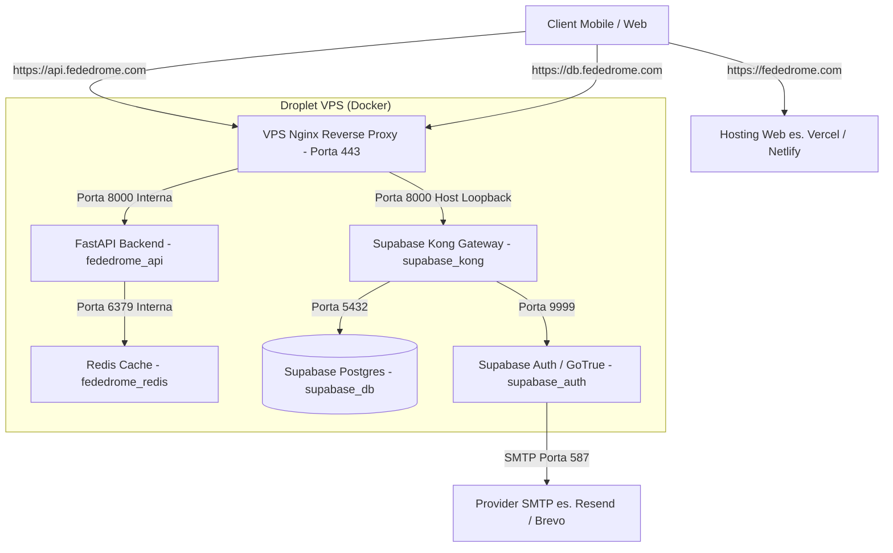

# 🚀 Guida Completa al Deploy di Fededrome

Questa guida descrive passo-passo tutta la procedura di deployment in produzione dell'intera infrastruttura Fededrome (Frontend Flutter/Web, FastAPI Backend, Redis e Supabase Self-Hosted) su un singolo droplet VPS (es. DigitalOcean) con configurazione DNS coerente e certificati SSL automatici.

---

## 🗺️ Architettura di Rete e Schema DNS

Tutti i servizi sono esposti in modo sicuro sotto HTTPS usando un unico indirizzo IP pubblico del Droplet VPS. Nginx funge da gateway principale, gestendo la terminazione SSL e smistando le richieste in base al nome di dominio.



### Tabella dei Domini e Puntamenti Coerenti

| Servizio / Risorsa | Indirizzo URL Configurato | Puntamento DNS / Target | Note |
| :--- | :--- | :--- | :--- |
| **Sito Web / Frontend** | `https://fededrome.com` | Record A → IP Host (Vercel / VPS) | Origine CORS autorizzata |
| **API Backend (FastAPI)** | `https://api.fededrome.com` | Record A → IP Droplet VPS | Gestito da Nginx su VPS |
| **Database & Auth (Supabase)** | `https://db.fededrome.com` | Record A → IP Droplet VPS | Gestito da Nginx → Kong |
| **Google Redirect URI** | `https://db.fededrome.com/auth/v1/callback` | Configurato su Google Cloud Console | Callback del login social |
| **Deep Linking Flutter** | `fededrome://*` | Schema custom mobile autorizzato | Gestisce il rientro in-app |

---

## 📡 Fase 1: Configurazione del Dominio e DNS (DigitalOcean)

Prima di avviare il Droplet VPS, configura i NameServer e i record DNS.

### 1. Delegare i NameServer (NS)
Nel pannello del provider in cui hai acquistato il dominio (es. Aruba, Namecheap, GoDaddy), imposta i NameServer di DigitalOcean:
* `ns1.digitalocean.com`
* `ns2.digitalocean.com`
* `ns3.digitalocean.com`

### 2. Aggiungere i Record DNS nel Pannello Networking di DigitalOcean
Accedi a DigitalOcean, vai su **Networking** > **Domains** > Aggiungi il dominio `fededrome.com`, e configura i seguenti record:

#### A. Record A (Puntamenti IP)
* **Puntamento per FastAPI (Backend):**
  - **Type:** `A` | **Hostname:** `api` | **Directs To:** IP Droplet VPS | **TTL:** `3600`
* **Puntamento per Supabase (Kong/Auth):**
  - **Type:** `A` | **Hostname:** `db` | **Directs To:** IP Droplet VPS | **TTL:** `3600`
* **Puntamento per il Web Frontend (se hostato sulla stessa VPS):**
  - **Type:** `A` | **Hostname:** `@` | **Directs To:** IP Droplet VPS | **TTL:** `3600`

#### B. Record TXT (Deliverability Email e Autorizzazioni SMTP)
Questi record sono obbligatori per convalidare il dominio sul server SMTP ed evitare che le mail di registrazione finiscano in spam.

* **1. Record SPF (Sender Policy Framework):**
  - **Type:** `TXT` | **Hostname:** `@` | **Value:** `v=spf1 include:spf.sendinblue.com ~all` (se usi Brevo) oppure `v=spf1 include:amazonses.com ~all` (se usi Resend).
* **2. Record DKIM (Firma Crittografica):**
  - **Type:** `TXT` | **Hostname:** `mail._domainkey` (o selettore del provider) | **Value:** Incolla la stringa fornita da Brevo/Resend.
* **3. Record DMARC:**
  - **Type:** `TXT` | **Hostname:** `_dmarc` | **Value:** `v=DMARC1; p=none; rua=mailto:dmarc-reports@fededrome.com`

---

## 🖥️ Fase 2: Inizializzazione della VPS (Droplet Ubuntu)

Collegati in SSH al tuo Droplet VPS ed installa i pacchetti necessari.

```bash
# Aggiorna il sistema operativo
sudo apt update && sudo apt upgrade -y

# Installa pacchetti di sistema di base
sudo apt install -y curl git ufw certbot

# Configura il firewall UFW (apri solo le porte essenziali)
sudo ufw default deny incoming
sudo ufw default allow outgoing
sudo ufw allow ssh
sudo ufw allow http
sudo ufw allow https
sudo ufw --force enable
```

### 1. Installazione Docker & Docker Compose
Installa Docker Engine ed il plugin Docker Compose seguendo la procedura ufficiale:

```bash
# Aggiungi la chiave GPG ufficiale di Docker
sudo install -m 0755 -d /etc/apt/keyrings
sudo curl -fsSL https://download.docker.com/linux/ubuntu/gpg -o /etc/apt/keyrings/docker.asc
sudo chmod a+r /etc/apt/keyrings/docker.asc

# Configura il repository APT
echo \
  "deb [arch=$(dpkg --print-architecture) signed-by=/etc/apt/keyrings/docker.asc] https://download.docker.com/linux/ubuntu \
  $(. /etc/os-release && echo "$VERSION_CODENAME") stable" | \
  sudo tee /etc/apt/sources.list.d/docker.list > /dev/null

# Installa Docker
sudo apt update
sudo apt install -y docker-ce docker-ce-cli containerd.io docker-buildx-plugin docker-compose-plugin

# Abilita ed avvia Docker al boot
sudo systemctl enable docker
sudo systemctl start docker
```

### 2. Generazione Certificati SSL Let's Encrypt (Multi-Dominio)
Generiamo un unico certificato SSL valido sia per `api.fededrome.com` che per `db.fededrome.com`:

```bash
# Richiedi il certificato (Certbot userà una porta 80 temporanea standalone)
sudo certbot certonly --standalone -d api.fededrome.com -d db.fededrome.com \
  --non-interactive --agree-tos --email admin@fededrome.com
```
*I certificati verranno salvati in `/etc/letsencrypt/live/api.fededrome.com/`.*

---

## 🗃️ Fase 3: Setup di Supabase Self-Hosted

Eseguiamo l'installazione di Supabase in una cartella separata dal codice applicativo backend.

```bash
# Clona il repository ufficiale di Supabase a versione controllata
git clone --depth 1 https://github.com/supabase/supabase.git /opt/supabase

# Entra nella cartella di configurazione Docker
cd /opt/supabase/docker
cp .env.example .env
```

### 1. Generazione delle Password e dei Secret
Esegui i comandi `openssl` per generare password sicure e copiale:

```bash
# Password per PostgreSQL
openssl rand -base64 32

# Chiave segreta simmetrica JWT (Minimo 32 caratteri)
openssl rand -base64 32
```

### 2. Generazione di ANON_KEY e SERVICE_ROLE_KEY
Usa questo script Python rapido per generare i token JWT corretti da inserire nel file `.env` di Supabase.

```bash
# Installa PyJWT per firmare i token
pip3 install PyJWT
```

Esegui lo script (salvalo come `gen_keys.py` ed eseguilo con `python3 gen_keys.py`):
```python
import jwt
from datetime import datetime, timedelta

jwt_secret = "INSERISCI_IL_JWT_SECRET_GENERATO_SOPRA"

anon_payload = {
    "role": "anon",
    "iss": "supabase",
    "iat": int(datetime.utcnow().timestamp()),
    "exp": int((datetime.utcnow() + timedelta(days=3650)).timestamp())
}
anon_key = jwt.encode(anon_payload, jwt_secret, algorithm="HS256")

service_payload = {
    "role": "service_role",
    "iss": "supabase",
    "iat": int(datetime.utcnow().timestamp()),
    "exp": int((datetime.utcnow() + timedelta(days=3650)).timestamp())
}
service_key = jwt.encode(service_payload, jwt_secret, algorithm="HS256")

print("ANON_KEY:", anon_key)
print("SERVICE_ROLE_KEY:", service_key)
```

### 3. Configurazione del file `/opt/supabase/docker/.env`
Modifica il file `.env` compilando le chiavi con i valori generati sopra:

```dotenv
# Postgres & JWT
POSTGRES_PASSWORD=il_tuo_postgres_password_sicuro
JWT_SECRET=il_tuo_jwt_secret_generato
ANON_KEY=il_tuo_anon_key_generato
SERVICE_ROLE_KEY=il_tuo_service_role_key_generato

# Disabilita l'autoconferma email per obbligare l'utente alla verifica
GOTRUE_MAILER_AUTOCONFIRM=false

# Configurazione SMTP per Resend
SMTP_HOST=smtp.resend.com
SMTP_PORT=587
SMTP_USER=resend
SMTP_PASS=re_tuachiaveapi_resend_generata
SMTP_SENDER_EMAIL=noreply@fededrome.com

# Replicazione variabili per GoTrue (Auth)
GOTRUE_SMTP_HOST=smtp.resend.com
GOTRUE_SMTP_PORT=587
GOTRUE_SMTP_USER=resend
GOTRUE_SMTP_PASS=re_tuachiaveapi_resend_generata
GOTRUE_SMTP_ADMIN_EMAIL=noreply@fededrome.com
GOTRUE_SMTP_SENDER_NAME="Fededrome"

# Configurazione Deep Link e Redirects
GOTRUE_SITE_URL=https://fededrome.com
GOTRUE_URI_ALLOW_LIST=https://fededrome.com/*,fededrome://*

# Abilitazione Google OAuth
GOOGLE_ENABLED=true
GOOGLE_CLIENT_ID=il_tuo_client_id_google.apps.googleusercontent.com
GOOGLE_SECRET=il_tuo_client_secret_google
```

### 4. Abilitazione Google OAuth in `/opt/supabase/docker/docker-compose.yml`
Assicurati che sotto il servizio `auth`, all'interno della sezione `environment`, siano dichiarate queste righe:
```yaml
      GOTRUE_EXTERNAL_GOOGLE_ENABLED: ${GOOGLE_ENABLED}
      GOTRUE_EXTERNAL_GOOGLE_CLIENT_ID: ${GOOGLE_CLIENT_ID}
      GOTRUE_EXTERNAL_GOOGLE_SECRET: ${GOOGLE_SECRET}
      GOTRUE_EXTERNAL_GOOGLE_REDIRECT_URI: https://db.fededrome.com/auth/v1/callback
```

### 5. Avvio di Supabase
```bash
docker compose up -d
# Verifica che tutti i servizi Supabase siano attivi ed in stato healthy
docker compose ps
```

---

## ⚙️ Fase 4: Setup del Backend FastAPI di Fededrome

Clona il repository dell'applicazione e compila il file `.env` di produzione.

```bash
# Clona il codice sorgente
git clone https://github.com/SteMotta/Fededrome-backend.git /opt/fededrome-backend
cd /opt/fededrome-backend

# Crea il file di configurazione di produzione
cp .env.example .env
nano .env
```

### 1. Configurazione del file `/opt/fededrome-backend/.env`
Compila il file di produzione inserendo le chiavi generate in Supabase e le API esterne:

```dotenv
# Supabase (Punta all'URL DNS pubblico di Supabase appena configurato)
SUPABASE_URL=https://db.fededrome.com
SUPABASE_ANON_KEY=incolla_l_anon_key_di_supabase
SUPABASE_SERVICE_ROLE_KEY=incolla_il_service_role_key_di_supabase

# OAuth Client ID (usato anche dal backend per validare i token)
GOOGLE_CLIENT_ID=il_tuo_client_id_google.apps.googleusercontent.com
GOOGLE_CLIENT_SECRET=il_tuo_client_secret_google

# API Esterne
TMDB_API_KEY=il_tuo_tmdb_bearer_token
YOUTUBE_API_KEY=la_tua_youtube_data_api_v3_key

# Database di cache Redis (usa il nome del container nel docker-compose del backend)
REDIS_URL=redis://fededrome_redis:6379/0

# Configurazione Ambiente
ENV=production
ALLOWED_ORIGINS=["https://fededrome.com", "https://app.fededrome.com"]
```

### 2. Applicazione delle Migrazioni SQL in Produzione
Dobbiamo applicare tutti gli script di migrazione nella cartella `supabase/migrations/` per creare le tabelle e impostare le RLS direttamente sul database di produzione:

```bash
# Script automatico per scansionare e iniettare le migrazioni nel database containerizzato
for file in /opt/fededrome-backend/supabase/migrations/*.sql; do
  echo "Applicazione della migrazione: $file..."
  docker exec -i supabase-db psql -U postgres -d postgres < "$file"
done
```

### 3. Avvio dei Servizi Backend (FastAPI, Redis, Nginx)
```bash
docker compose up -d --build
# Controlla lo stato dei container
docker compose ps
```

---

## 🔐 Fase 5: Configurazione su Google Cloud Console (Google OAuth)

Per far funzionare il login Google sia sulla versione Web che Mobile:

1. Accedi alla console di [Google Cloud](https://console.cloud.google.com).
2. Seleziona il progetto associato a Fededrome.
3. Vai su **APIs & Services** > **Credentials**.
4. Modifica il tuo **OAuth 2.0 Client ID** per applicazione Web:
   - **Authorized JavaScript origins:** `https://fededrome.com`
   - **Authorized redirect URIs:** `https://db.fededrome.com/auth/v1/callback` (questo corrisponde al valore specificato in `GOTRUE_EXTERNAL_GOOGLE_REDIRECT_URI` di GoTrue).
5. Salva le modifiche.

---

## 📱 Fase 6: Configurazione e Compilazione del Frontend (Flutter)

Prima di buildare l'applicazione client per la pubblicazione o per i test nativi:

### 1. Configurazione delle variabili d'ambiente in Flutter
Crea o modifica il file `.env` di produzione nel codice del frontend in `c:\Users\stefa\StudioProjects\fededrome`:

```dotenv
# API Endpoints
SUPABASE_URL=https://db.fededrome.com
SUPABASE_ANON_KEY=incolla_l_anon_key_di_supabase
API_URL=https://api.fededrome.com

# Social login
GOOGLE_CLIENT_ID_WEB=il_tuo_client_id_google.apps.googleusercontent.com
```

### 2. Configurazione del Deep Linking
Assicurati che l'app Flutter sia registrata sul sistema operativo dello smartphone per intercettare l'URL scheme `fededrome://` per catturare il redirect dopo la conferma email o il login social.

* **Android (`android/app/src/main/AndroidManifest.xml`):**
  Nel tag `<activity>` principale aggiungi l'intent filter:
  ```xml
  <intent-filter android:label="fededrome_auth">
      <action android:name="android.intent.action.VIEW" />
      <category android:name="android.intent.category.DEFAULT" />
      <category android:name="android.intent.category.BROWSABLE" />
      <data android:scheme="fededrome" android:host="login-callback" />
  </intent-filter>
  ```
* **iOS (`ios/Runner/Info.plist`):**
  Aggiungi le chiavi per l'URL Scheme:
  ```xml
  <key>CFBundleURLTypes</key>
  <array>
      <dict>
          <key>CFBundleTypeRole</key>
          <string>Editor</string>
          <key>CFBundleURLSchemes</key>
          <array>
              <string>fededrome</string>
          </array>
      </dict>
  </array>
  ```

### 3. Comandi di Build del Frontend
Esegui la compilazione in modalità Release:

```bash
# Per compilare il pacchetto Android (APK standard per installazione manuale)
flutter build apk --release --obfuscate --split-debug-info=build/app/outputs/symbols

# Per compilare il pacchetto iOS (richiede macOS ed Xcode)
flutter build ipa --release --obfuscate --split-debug-info=build/ios/outputs/symbols
```

---

## 🔄 Fase 7: Manutenzione e Rinnovo Automatico SSL (Cron)

Let's Encrypt scade ogni 90 giorni. Avendo configurato Nginx all'interno di un container che occupa le porte 80 e 443 del server, l'agent automatico standalone di Certbot fallirà se non liberiamo le porte durante il rinnovo.

Configura un cron job sul server che arresti temporaneamente Nginx solo per il tempo di verifica di Certbot (pochi secondi) e lo riavvii subito dopo:

```bash
# Apri l'editor dei cron del root
sudo crontab -e

# Aggiungi la seguente riga in fondo al file (esegue il check all'03:00 del primo giorno di ogni mese)
0 3 1 * * certbot renew --pre-hook "docker compose -f /opt/fededrome-backend/docker-compose.yml stop nginx" --post-hook "docker compose -f /opt/fededrome-backend/docker-compose.yml start nginx"
```
